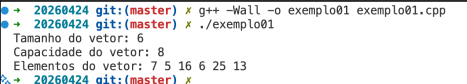

# Vector, set e pair
## Array dinâmico
- Capaz de mudar de tamanho dinamicamente
> Java = ArrayList e LinkedList

> Python = List / Array

> C/C++ = STL vector
~~~cpp
// Exemplo

#include <iostream>
#include <vector>
using namespace std;
int main(){
    vector<int> v = {7, 5, 16, 8};
    v.push_back(25);
    v.push_back(13);
    v[3]=6;
    cout << "Tamanho do vetor: " << v.size() << endl;
    cout << "Capacidade do vetor: " << v.capacity() << endl;
    cout << "Elementos do vetor: ";
    for(int n : v) {
    cout << n << ' ';
    }
    cout << endl;
}
~~~
Resultado

## C++ Set
- Elementos não podem ser acessados por índice
- No c++, guarda os elementos de maneira ordenada
- Elementos não se repetem no set
~~~cpp
#include <iostream>
#include <set>
using namespace std;
int main(){
    set<int> s1;
    s1.insert(5);
    s1.insert(3);
    s1.insert(8);
    s1.insert(5); // Não será inserido, pois o 5 já existe
    cout << "Elementos do conjunto: ";
    for(int x : s1) {
        cout << x << ' ';
    }
    cout << endl;
    cout << "Tamanho do conjunto: " << s1.size() << endl;
    if (s1.count(3) == 1){
        cout << "O 3 está no conjunto." << endl;
    } else {
        cout << "O 3 não está no conjunto." << endl;
    }
    return 0;
}
~~~

## C++ Pair
- Tupla de dois elementos
~~~cpp
#include <iostream>
#include <utility>
using namespace std;
int main() {
    pair<int, string> p1(42, "Hello");
    cout << "Primeiro elemento: " << p1.first << endl;
    cout << "Segundo elemento: " << p1.second << endl;
    pair<int, double> p2 = make_pair(7, 3.14);
    cout << "Primeiro elemento: " << p2.first << endl;
    cout << "Segundo elemento: " << p2.second << endl;
    p2.first = 10;
    p2.second = 2.718;
    cout << "Primeiro elemento atualizado: " << p2.first << endl;
    cout << "Segundo elemento atualizado: " << p2.second << endl;
    return 0;
}
~~~

- É possível existir um vector de pares
~~~cpp
vector<pair<string, int>> exemplo;
~~~

## Iteradores
- begin(): iterator para o primeiro elemento
- end(): iterator para achar null (final depois do último elemento)

~~~cpp
int main(){
    vector<int> v {137, 42, 2178, 3141, 6266, 6023};
    for (vector<int>::iterator it = v.begin();it != v.end();++it)
    cout << *it << endl;
    return 0;
}

~~~

> OBS: auto& infere o tipo de dado a partir da atribuição
